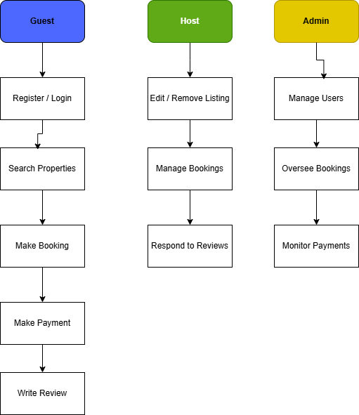

# Requirement Analysis in Software Development

## About the Project

The **Requirement Analysis Project** focuses on crafting a comprehensive foundation for software development by documenting, analyzing, and structuring requirements. Through a series of well-defined tasks, this project will simulate a real-world scenario in building a booking management system, emphasizing clarity, precision, and structure in defining project needs.

## Learning Objective

This project is designed to enhance a professional developer’s ability to:

* Master principles and methodologies of Requirement Analysis in the Software Development Lifecycle (SDLC).
* Translate business/project needs into structured documentation.
* Identify and document both functional and non-functional requirements.
* Use tools like Draw\.io to create visual diagrams representing system requirements.
* Define clear acceptance criteria aligned with business and user goals.
* Apply best practices to produce industry-standard technical documentation.

## Requirements to Complete the Project

To participate and complete the project successfully, learners should:

* Have a GitHub account and know how to create and manage repositories.
* Be familiar with writing clear markdown documentation (README.md).
* Understand the SDLC and the role of requirement analysis.
* Know how to use visual diagram tools (e.g., Draw\.io).
* Be able to define and communicate use cases, requirements, and criteria.

## Key Highlights

* **Real-World Simulation**: Replicates professional requirement analysis workflows.
* **Comprehensive Documentation**: Functional vs. non-functional requirements, use cases, and user stories.
* **Visual Tools**: Use diagrams to enhance understanding of actor-system interactions.
* **Acceptance Criteria**: Clear success metrics for each requirement.
* **Professional Standards**: Structure and practices aligned with industry norms.

This repository serves as the structured workspace to complete all tasks related to requirement analysis, setting the groundwork for a robust and scalable software system.

---

## What is Requirement Analysis?

**Requirement Analysis** is a fundamental phase in the Software Development Lifecycle (SDLC) that involves identifying, gathering, analyzing, validating, and documenting the functional and non-functional requirements of a software system.

This process ensures that the development team fully understands what needs to be built and that the final product aligns with the goals of both the business and the end users. Requirement Analysis lays the groundwork for effective planning, design, development, testing, and deployment.

### Key Activities

* **Requirement Gathering**: Collecting input from stakeholders using methods such as interviews, surveys, and workshops.
* **Requirement Documentation**: Defining and recording clear, concise, and comprehensive requirements.
* **Requirement Validation**: Reviewing requirements to ensure they are correct, complete, and feasible.
* **Requirement Prioritization**: Ranking features and functionalities based on stakeholder needs and project scope.

### Importance in the SDLC

* Helps avoid misunderstandings between stakeholders and developers.
* Reduces the risk of costly changes and project delays.
* Provides a clear reference for design, development, and quality assurance.
* Ensures that the product delivers real value to users and aligns with business objectives.
* Forms the basis for test planning, acceptance criteria, and performance evaluation.

---

## Why is Requirement Analysis Important?

Requirement Analysis plays a crucial role in ensuring the success of a software project. It acts as a bridge between stakeholders and the development team, setting a strong foundation for all phases of the Software Development Lifecycle (SDLC).

### 1. Reduces Miscommunication and Errors

By thoroughly analyzing and documenting requirements, all stakeholders—clients, developers, testers, and designers—develop a shared understanding of the system. This minimizes misunderstandings and prevents errors due to misinterpretation.

### 2. Saves Time and Cost

Identifying system requirements early in the project helps avoid costly changes later. A well-defined scope reduces rework, streamlines development, and leads to more efficient resource allocation.

### 3. Improves Project Planning and Estimation

Clear requirements make it easier to estimate timelines, budgets, and development efforts. This enables better project planning, milestone tracking, and risk management throughout the SDLC.

### 4. Enhances Product Quality

Requirement Analysis ensures that all functionalities meet the user’s needs and expectations. It leads to a product that is not only functional but also user-centric and aligned with business goals.

---

## Key Activities in Requirement Analysis

Requirement Analysis involves a series of structured activities that ensure the system requirements are accurate, complete, and aligned with stakeholder expectations. Below are the five key activities:

* **Requirement Gathering**
  This step focuses on collecting information from various stakeholders, including clients, end-users, and domain experts. The goal is to understand what the system should accomplish.

* **Requirement Elicitation**
  Elicitation goes beyond simple collection by using techniques such as interviews, questionnaires, workshops, brainstorming, and observation to uncover the true needs behind stated requirements.

* **Requirement Documentation**
  All collected requirements are formally documented in a structured format, typically using requirement specification documents, user stories, or use cases. This documentation serves as a reference for the development team.

* **Requirement Analysis and Modeling**
  In this phase, requirements are analyzed for completeness, consistency, and feasibility. Modeling tools such as data flow diagrams, entity-relationship diagrams, or UML are often used to visualize and refine requirements.

* **Requirement Validation**
  Validation ensures that documented requirements accurately represent stakeholder needs and align with business objectives. Techniques like peer reviews, walkthroughs, and prototyping are used to verify the correctness of requirements.

---

## Types of Requirements

In software engineering, requirements are typically divided into two main categories: **Functional** and **Non-functional**. Both are essential to fully define the behavior and expectations of a system.

### Functional Requirements

**Definition**:
Functional requirements specify what the system should do. These are features or services the system must provide to meet user needs.

**Examples for a Booking Management System**:

* Users must be able to register and log into their accounts.
* Hosts can create, edit, and delete property listings.
* Guests can search for available properties based on location and date.
* The system should allow guests to book a property for specific dates.
* Users should receive email confirmations after completing a booking.
* Guests can write and submit reviews after their stay.
* Admin users can manage users and moderate content.

### Non-functional Requirements

**Definition**:
Non-functional requirements describe how the system performs tasks. They focus on the system's quality attributes such as performance, security, usability, and scalability.

**Examples for a Booking Management System**:

* The platform must support up to 1,000 concurrent users without performance degradation.
* All sensitive user data must be encrypted both in transit and at rest.
* The application should load any page in under 2 seconds.
* The system must maintain 99.9% uptime throughout the year.
* The user interface should be accessible and responsive on both desktop and mobile devices.
* The application should support localization for multiple languages.

---

## Use Case Diagrams

**Use Case Diagrams** are visual representations that describe how different users (actors) interact with a system. They provide a high-level overview of the functional requirements by illustrating the relationship between actors and use cases (actions or services).

### Benefits of Use Case Diagrams
- Clarify system functionalities from the user's perspective.
- Help stakeholders understand system behavior.
- Identify external and internal system interactions early in the project lifecycle.
- Support the requirement gathering and validation process.

### Booking Management System - Use Case Diagram

The diagram below illustrates key interactions between users (Guest, Host, Admin) and the system features:

---

## Acceptance Criteria

**Acceptance Criteria** are predefined conditions that a software product must meet to be accepted by the user, customer, or other stakeholders. They serve as a checklist that ensures the functionality meets the specified requirements and is working as expected.

### Importance of Acceptance Criteria in Requirement Analysis

* **Clarifies Expectations**: Defines what success looks like for a specific feature or functionality.
* **Guides Development and Testing**: Helps developers understand exactly what needs to be built and provides a reference for writing test cases.
* **Reduces Miscommunication**: Acts as a shared understanding between stakeholders and the development team.
* **Supports Validation**: Ensures the final product meets both functional and business goals before delivery.

### Example: Acceptance Criteria for Checkout Feature

**Feature**: Checkout Process in the Booking Management System

**Acceptance Criteria**:

* The user must be logged in to initiate the checkout.
* The system must display selected property details, booking dates, total price, and guest count.
* The user must be able to modify booking details before confirmation.
* The total cost must be calculated automatically based on duration and pricing rules.
* The payment form must accept valid credit/debit card inputs.
* Upon successful payment, a booking confirmation email must be sent to the user.
* If payment fails, the system must show an appropriate error message without processing the booking.

---

